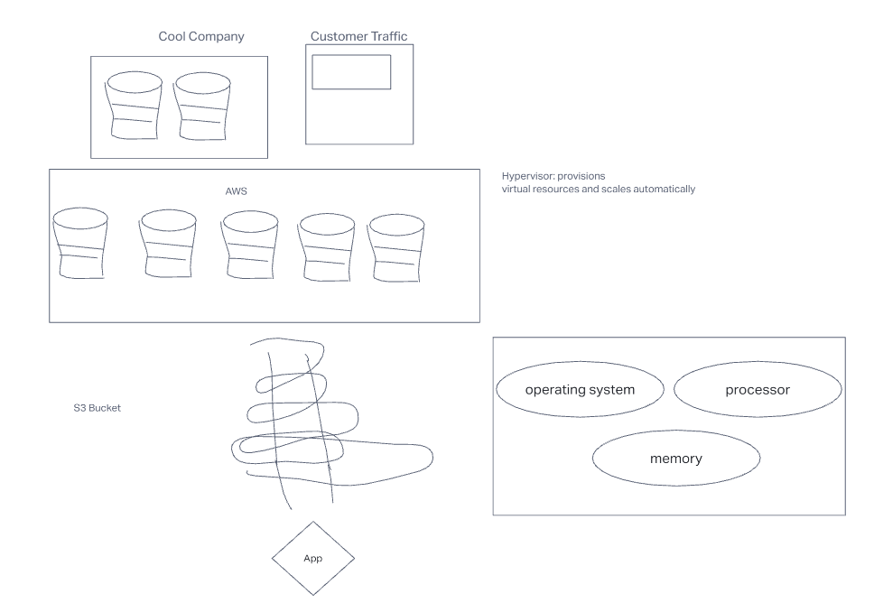

# AWS Cloud Server

## Author: Tyler Main

## Problem Domain

## Deployed Links

### GUI

[Deploy 1](http://cloudserver401d48-env-1.eba-wuhmkimh.us-east-2.elasticbeanstalk.com/)

### CLI

[Deploy 2](http://2-dev.us-east-1.elasticbeanstalk.com/)

## Phase 1

Create a new environment, using Elastic Beanstalk from the AWS Control Panel (GUI)
Manually deploy your application to this environment by uploading a .zip file

## Phase 2

Using the same server, create a new environment using Elastic Beanstalk from your terminal
Manually deploy your application to this environment by using eb deploy

## Dependencies

* Express

### Setup

* npm init -y
* create basic application foundation
* npm i express

### UML

